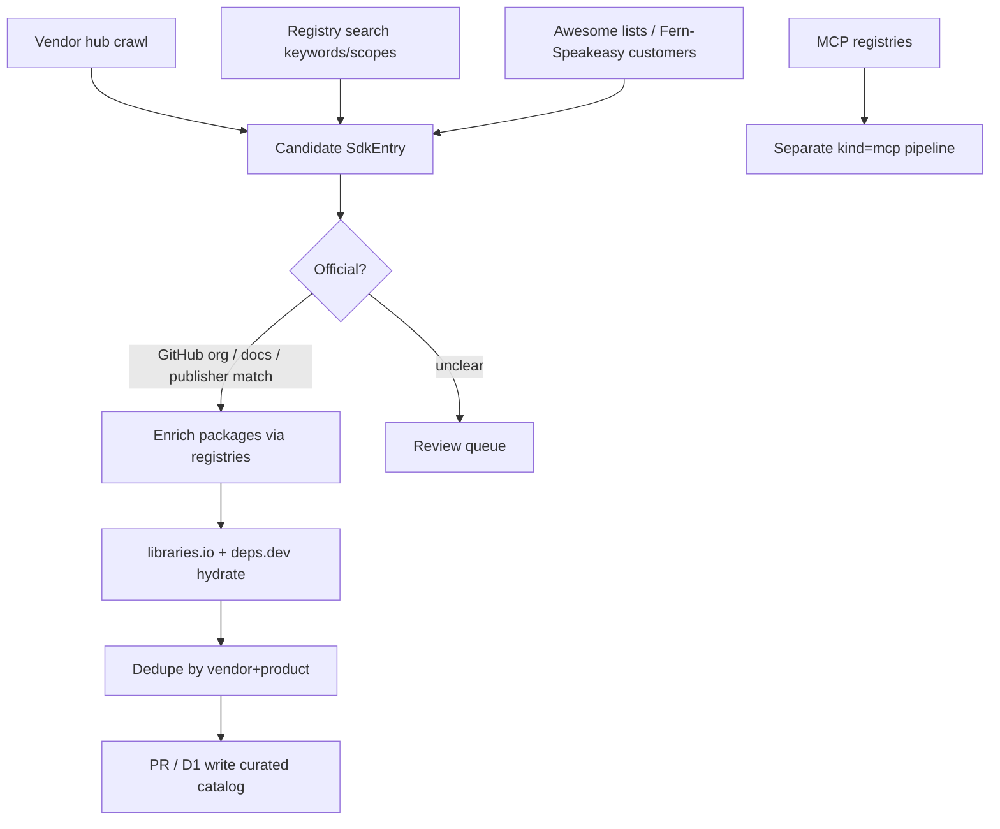

# SDK Discovery Sources — Research Notes

**Project:** [sdks.directory](https://sdks.directory) — agent-optimized catalog of official client libraries  
**Catalog today:** ~59 hand-curated `SdkEntry` records in `src/data/sdks.ts` (vendor-centric: one entry → many languages/packages)  
**Goal:** Discoverable sources to systematically expand coverage  
**Date:** 2026-07-27

---

## Executive summary

| Priority | Best sources for expansion |
| --- | --- |
| **Tier 1 (start here)** | Vendor docs hubs + GitHub org/`official` heuristics; npm/PyPI keyword+scope search; libraries.io / deps.dev for enrichment |
| **Tier 2 (scale)** | Cross-registry search via libraries.io; pkg.go.dev API; NuGet/crates/RubyGems/Packagist search; APIs.guru → generator ecosystems |
| **Tier 3 (adjacent)** | MCP registries (Glama, official MCP Registry, Smithery); awesome lists; public-apis (API discovery → then find SDKs) |
| **Avoid as primary** | Blind registry dumps (“everything named `*-sdk`”); RapidAPI marketplace SDKs; unscoped GitHub `topic:sdk` without filters |

**Recommended ingest shape (matches current schema):** keep **one catalog entry per vendor/product**, with `packages[]` spanning registries — not one entry per language package.

---

## 1. Package registries

### 1.1 npm

| | |
| --- | --- |
| **URL** | https://www.npmjs.com · API docs: https://api-docs.npmjs.com/ · Registry: https://registry.npmjs.org |
| **Covers** | JS/TS/Node (largest client-library surface). Millions of packages; quality highly variable. |
| **Access** | Official search: `GET https://registry.npmjs.org/-/v1/search?text=…&size=250&from=0`. Packument: `GET /{package}`. Downloads: https://api.npmjs.org/downloads/point/last-month/{package}. Qualifiers: `keywords:sdk`, `scope:stripe`, author filters. Rate limits: undocumented; expect **429** — back off. Public metadata, no auth for read. |
| **Usefulness** | **High** — most agents ship Node/TS first; scopes (`@openai/*`, `@aws-sdk/*`) and `keywords` are strong signals for official clients. |
| **Ingest** | Query `text=keywords:sdk+client` (and vendor names from seed list); prefer scoped packages owned by verified orgs; enrich with downloads + GitHub repo from packument; collapse `@vendor/*` into one `SdkEntry`. |

### 1.2 PyPI

| | |
| --- | --- |
| **URL** | https://pypi.org · JSON API: https://docs.pypi.org/api/json/ · Index: https://docs.pypi.org/api/index-api/ · BigQuery: https://docs.pypi.org/api/bigquery/ |
| **Covers** | Python. ~500k+ projects; strong AI/ML SDK density. |
| **Access** | `GET https://pypi.org/pypi/{name}/json`; full name list via Simple Index `Accept: application/vnd.pypi.simple.v1+json` on https://pypi.org/simple/. No first-class full-text search API (use warehouse web search, third-party, or BigQuery). Downloads: `bigquery-public-data.pypi.file_downloads` (CC license; 1 TB/mo BigQuery free tier). |
| **Usefulness** | **High** — official packages often named `{vendor}` or `{vendor}-sdk`; `info.project_urls`, classifiers, and org ownership help verify official status. |
| **Ingest** | Seed from vendor list → resolve PyPI names; scan classifiers/`Keywords` for `SDK`/`API Client`; join npm/PyPI names that share GitHub org; use BigQuery for popularity ranking. |

### 1.3 crates.io (Rust)

| | |
| --- | --- |
| **URL** | https://crates.io · Data access: https://crates.io/data-access · OpenAPI: https://crates.io/api/openapi.json |
| **Covers** | Rust crates. Smaller volume; higher average quality. Keywords/categories usable. |
| **Access** | REST API (Cargo Web API superset). **Hard limit: 1 req/s** + descriptive `User-Agent` with contact. Prefer sparse index / static dumps for bulk. |
| **Usefulness** | **Medium** — good for Rust language coverage; fewer “official” multi-lang vendors publish Rust first. |
| **Ingest** | Search `sdk` / `client` keywords; match crate owners to known vendor GitHub orgs; throttle strictly. |

### 1.4 Maven Central

| | |
| --- | --- |
| **URL** | https://central.sonatype.com · Search API: https://central.sonatype.org/search/rest-api-guide/ · Endpoint: https://search.maven.org/solrsearch/select |
| **Covers** | Java/Kotlin/Scala JVM artifacts. Huge volume; groupId often encodes vendor (`com.stripe`, `software.amazon.awssdk`). |
| **Access** | Solr query API (`q=g:com.stripe`, `a:…`, `wt=json`). Consumption limits → **429** for heavy traffic (org/IP based); use caching / repo manager patterns. |
| **Usefulness** | **High** for JVM SDKs; groupId is an excellent official-vendor signal. |
| **Ingest** | Map known vendor groupIds; search `sdk` in artifactId; prefer `*-sdk` under corporate groupIds over random forks. |

### 1.5 Go packages (pkg.go.dev)

| | |
| --- | --- |
| **URL** | https://pkg.go.dev · API: https://pkg.go.dev/v1beta/api · Blog: https://go.dev/blog/pkgsite-api · OpenAPI: https://pkg.go.dev/v1beta/openapi.yaml |
| **Covers** | All modules fetched via proxy.golang.org. Module path = import path (often `github.com/vendor/…`). |
| **Access** | Official **v1beta** JSON API: `/v1beta/search?q=`, `/v1beta/module/{path}`, `/v1beta/package/{path}`, symbols, vulns, imported-by. Designed partly for AI tooling. Also: module index https://index.golang.org/. |
| **Usefulness** | **High** — module path + vanity domains make official ownership clear (`cloud.google.com/go`, `github.com/stripe/stripe-go`). |
| **Ingest** | Search `sdk` / vendor names; filter module paths under known orgs; attach as `registry: "go"` package refs. |

### 1.6 NuGet

| | |
| --- | --- |
| **URL** | https://www.nuget.org · V3 index: https://api.nuget.org/v3/index.json · Search docs: https://learn.microsoft.com/en-us/nuget/api/search-query-service-resource · Rate limits: https://learn.microsoft.com/en-us/nuget/api/rate-limits |
| **Covers** | .NET / C#. Tags + package IDs (`Stripe.net`, `AWSSDK.*`). |
| **Access** | V3 `SearchQueryService` — **not rate-limited currently** (vs V1/V2). `skip` max 3000, `take` max 1000. |
| **Usefulness** | **Medium–High** for C# coverage; Microsoft/Azure packages dominate volume. |
| **Ingest** | Search `sdk` / `client` tags; resolve `packageid:` for known vendors; group `AWSSDK.*` under one AWS entry. |

### 1.7 RubyGems

| | |
| --- | --- |
| **URL** | https://rubygems.org · API: https://guides.rubygems.org/rubygems-org-api/ · Limits: https://guides.rubygems.org/rubygems-org-rate-limits/ |
| **Covers** | Ruby gems (~160k+). Classic home for Stripe/Twilio-style official gems. |
| **Access** | `GET https://rubygems.org/api/v1/search.json?query=…&page=N` (30/page). Gem info `/api/v1/gems/{name}.json`. **~10 req/s** API/site load-balancer limit. |
| **Usefulness** | **Medium** — fewer new SDKs than npm/PyPI, but high official-gem density for SaaS APIs. |
| **Ingest** | Query vendor names + `sdk`; verify owners; link to same GitHub org as other languages. |

### 1.8 Packagist (PHP)

| | |
| --- | --- |
| **URL** | https://packagist.org · API docs: https://packagist.org/apidoc |
| **Covers** | PHP Composer packages. Vendor/package naming (`stripe/stripe-php`) is very clean. |
| **Access** | `GET https://packagist.org/search.json?q=…` (+ `tags`, `type`, pagination). Package metadata dumps available. Guidance: **≤10 concurrent** requests (≤20 for static). |
| **Usefulness** | **Medium** — excellent naming for official clients; smaller agent demand than JS/Python. |
| **Ingest** | Search `sdk` / vendor; `vendor/package` → map vendor slug directly into catalog. |

### 1.9 pub.dev (Dart / Flutter)

| | |
| --- | --- |
| **URL** | https://pub.dev · Official API help: https://pub.dev/help/api · Search help: https://pub.dev/help/search |
| **Covers** | Dart/Flutter packages. Publishers (`publisher:google.dev`) are strong official signals. |
| **Access** | Official: package names list, metadata, scores. **No official search API** — docs say fetch names and search locally. Unofficial clients hit site search (fragile). Publisher filter via UI/query syntax. |
| **Usefulness** | **Medium–Low** for agent catalog volume; **High** when targeting Flutter mobile SDKs. |
| **Ingest** | Pull publisher package lists for known vendors; treat `publisher:` as officialness signal. |

### 1.10 Cross-registry aggregators

#### libraries.io

| | |
| --- | --- |
| **URL** | https://libraries.io · API: https://libraries.io/api |
| **Covers** | 40+ platforms, millions of packages; SourceRank; dependents; repo links. |
| **Access** | REST + **API key** (free with account). Project, dependencies, dependents, search across platforms. |
| **Usefulness** | **High** — best single enrichment layer to unify npm/PyPI/Maven/… and attach GitHub. |
| **Ingest** | After candidate discovery, hydrate metadata + SourceRank; use dependents as popularity proxy. |

#### deps.dev (Google Open Source Insights)

| | |
| --- | --- |
| **URL** | https://deps.dev · API: https://docs.deps.dev/api/v3/ · BigQuery: https://docs.deps.dev/bigquery/ · Proto: https://github.com/google/deps.dev |
| **Covers** | npm, PyPI, Maven, Cargo, NuGet, Go, RubyGems (+ advisories, graphs). |
| **Access** | JSON HTTP + gRPC; no API key. Generated data **CC-BY 4.0**. BigQuery public dataset for bulk. |
| **Usefulness** | **High** for security/license enrichment and cross-ecosystem identity; weaker for *discovery* of “is this an SDK?” |
| **Ingest** | Validate candidates; attach licenses/advisories; BigQuery joins across systems for same product. |

---

## 2. Awesome lists & curated directories

| Name | URL | Covers | Access | Usefulness | Ingest |
| --- | --- | --- | --- | --- | --- |
| **awesome-sdks** | https://github.com/pajaydev/awesome-sdks | Multi-language official-ish SDK links (AWS, Slack, Twilio, Square…) | Parse README markdown; no API | **Medium** — seed list, stale risk | One-time scrape → candidate vendors; verify each against registries |
| **awesome-api-wrappers** | https://github.com/Api-Wrappers/awesome-api-wrappers | Selective wrappers/SDKs with package + GitHub links; quality-focused | Markdown tables | **Medium** — high signal, low volume | Prefer as human-review queue, not bulk |
| **SDK Junction** | https://sdkjunction.com/sdks/ | ~700+ GitHub-indexed “client libraries”; stars, install cmds | Site scrape / no public API documented | **Medium** — breadth; mixes generators vs clients | Deduplicate by GitHub repo; filter name contains `sdk`/`client` |
| **public-apis** | https://github.com/public-apis/public-apis | Huge API catalog (not SDKs) | Markdown; community forks with APIs | **Low–Medium** — finds *APIs*, then you hunt SDKs | Use as vendor/API discovery → “does official SDK exist?” pipeline |
| **Open Awesome / tags/sdk** | https://open-awesome.com/tags/sdk | Curated OSS tagged SDK | Web | **Low** | Occasional seed |

---

## 3. Vendor documentation hubs (highest precision)

These are the **best source of truth for “official”**. Prefer scraping/listing these over keyword search.

| Vendor | SDK index URL | Notes |
| --- | --- | --- |
| **Stripe** | https://docs.stripe.com/sdks · https://docs.stripe.com/libraries | Explicit server/web/mobile/community split — gold standard layout |
| **AWS** | https://aws.amazon.com/developer/tools/ · per-language SDK pages (e.g. https://aws.amazon.com/sdk-for-javascript/) | Many products; treat **AWS SDK** as one mega-entry or split by product line carefully |
| **Google Cloud** | https://cloud.google.com/sdk · https://docs.cloud.google.com/apis/docs/cloud-client-libraries | Cloud Client Libraries vs older API Client Libraries — document which |
| **Cloudflare** | https://developers.cloudflare.com/fundamentals/api/reference/sdks/ | Go / TypeScript / Python (Stainless-era shape) |
| **GitHub** | https://docs.github.com/en/rest/using-the-rest-api/libraries-for-the-rest-api | Official Octokit vs third-party — mirrors your `official` flag |
| **Twilio / Slack / Twilio-like SaaS** | Usually `/docs/libraries` or `/docs/sdks` | Pattern: scrape sitemap for `libraries\|sdks\|sdk` |

**Usefulness:** **High**  
**Access:** Mostly HTML docs (llms.txt / markdown mirrors increasingly common). Check each vendor for `llms.txt`, OpenAPI, or GitHub org README indexes.  
**Ingest:** Maintain a **vendor hub registry** (URL + CSS/JSON selectors or markdown fetch). Weekly crawl → diff languages/packages → PR into `sdks.ts` / D1.

**Other high-value hubs to add to the crawl list:** OpenAI, Anthropic, Hugging Face, Vercel, Supabase, Neon, PlanetScale, MongoDB, Datadog, Sentry, Segment, Twilio, SendGrid, Plaid, Square, Shopify, Discord, Notion, Linear, Vercel AI SDK docs, Azure SDK landing pages.

---

## 4. GitHub topics, orgs & search

| Source | URL / query | Covers | Access | Usefulness | Ingest |
| --- | --- | --- | --- | --- | --- |
| **Topic: sdk** | https://github.com/topics/sdk | Very noisy (device SDKs, game SDKs, random) | REST/GraphQL search | **Low** raw; **Med** with filters | `topic:sdk language:TypeScript stars:>100` |
| **Topic: client-library** | https://github.com/topics/client-library | Better precision for API clients | Same | **Medium** | Combine with `official` in README/description |
| **Topic: official-sdk** | https://github.com/topics/official-sdk | Sparse but high precision | Same | **High** (low recall) | Auto-accept candidates after license check |
| **Org crawl** | e.g. `github.com/stripe`, `openai`, `cloudflare` | All official repos | GitHub API (auth; rate limits 5k/hr authenticated) | **High** | Heuristic: repo name `*-sdk`, `*-node`, `*-python`; topics; `is:public fork:false` |
| **Code search** | `"generated with Stainless"` / `Speakeasy` / `fern generate` | Finds generated official SDKs | GitHub code search limits | **Medium** | Attribute generator; still vendor-official |

**API:** https://docs.github.com/en/rest/search · GraphQL `search(type: REPOSITORY)` — max **1000 results** per query; needs token for meaningful throughput.

---

## 5. OpenAPI / SDK generator ecosystems

These don’t list “all SDKs,” but they reveal **which vendors ship modern multi-language official clients**.

| Name | URL | Covers | Access | Usefulness | Ingest |
| --- | --- | --- | --- | --- | --- |
| **APIs.guru OpenAPI Directory** | https://apis.guru · Specs: https://github.com/APIs-guru/openapi-directory · API: https://api.apis.guru/v2/list.json | Thousands of public OpenAPI defs | Free JSON API, no auth | **Medium** — API discovery; SDK may or may not exist | For each provider, check docs for official SDK; else note “OpenAPI only / generate locally” |
| **OpenAPI Generator** | https://openapi-generator.tech · https://github.com/OpenAPITools/openapi-generator | 50+ language generators (not a catalog of published SDKs) | CLI/OSS | **Low** for catalog entries | Use only if you later offer “generate client” tooling |
| **Fern** | https://buildwithfern.com/sdks · Showcase: https://buildwithfern.com/showcase | Customers with generated multi-lang SDKs | Marketing pages | **Medium–High** | Scrape customer logos/case studies → verify packages |
| **Speakeasy** | https://www.speakeasy.com | Customers (Vercel, Clerk, Kong, …) | Marketing / docs | **Medium–High** | Same as Fern |
| **Stainless** | historically stainless.com (acquired by Anthropic ~2026; new signups wound down) | Many AI vendor SDKs share Stainless shape | Residual GitHub fingerprints | **Medium** | Detect via repo markers; don’t depend on hosted product |
| **Microsoft Kiota** | https://learn.microsoft.com/en-us/openapi/kiota/ | Client generation from OpenAPI | Docs | **Low** for discovery | — |
| **sdks.io** (via APIs.guru) | https://sdks.io/Search/FindSDKs?Bridge=APIs.guru | Auto-generated SDKs from specs | Web | **Low–Medium** | Distinguish generated-unofficial vs vendor-published |

---

## 6. Agent-relevant tool indexes (adjacent vertical)

Your schema already anticipates `kind: "mcp" | "plugin"`. These are **not SDK sources** but high-value for the same product.

| Name | URL | Covers | Access | Usefulness for **SDK** catalog | Suggested use |
| --- | --- | --- | --- | --- | --- |
| **Official MCP Registry** | https://registry.modelcontextprotocol.io · API docs in https://github.com/modelcontextprotocol/registry | Canonical MCP server metadata | `GET /v0/servers` (OpenAPI); preview stability | **Low** for SDKs; **High** for MCP vertical | Separate ingest into `kind: "mcp"` |
| **Glama MCP Registry** | https://glama.ai/mcp/servers | 60k+ servers, tool-level index | Web + their indexing | **Low** / **High** for tools | Cross-link: vendor with both SDK + MCP |
| **Smithery** | https://smithery.ai/servers | Hosted MCP install catalog | Web | **Low** | Same |
| **awesome-mcp.tools** | https://awesome-mcp.tools | ~3k curated MCP servers | Web/catalog | **Low** | Seed MCP list |
| **Vercel AI SDK / ecosystem lists** | https://sdk.vercel.ai | Providers/adapters | Docs | **Medium** | AI category expansion |

---

## 7. Enrichment-only sources (not discovery)

| Source | URL | Role |
| --- | --- | --- |
| npm download counts | https://api.npmjs.org/downloads/… | Popularity |
| PyPI BigQuery downloads | `bigquery-public-data.pypi.file_downloads` | Popularity |
| deps.dev advisories | API v3 `GetVersion` | Security badges |
| GitHub stars/forks | REST/GraphQL | Social proof |
| libraries.io SourceRank | API | Quality heuristic |

---

## 8. Suggested overall ingest strategy



### Phase 0 — Precision (week 1)
1. Encode **vendor hub URLs** for top ~100 SaaS/AI/cloud vendors.
2. Parse listed languages + package names into `SdkEntry` drafts.
3. Human/agent review against existing 59 entries (fill gaps only).

### Phase 1 — Recall (weeks 2–4)
1. npm: `keywords:sdk` + known scopes; PyPI name/org patterns; Packagist `vendor/*`; Maven groupIds.
2. GitHub: org repo heuristics for vendors missing from hubs.
3. Score candidates: downloads, stars, `official` docs link present, same GitHub org across languages.

### Phase 2 — Graph & quality
1. libraries.io + deps.dev enrichment.
2. Flag community forks (lower `official: false`).
3. Optional: APIs.guru providers **without** any official SDK → “OpenAPI-only” tag (future).

### Phase 3 — Agent vertical
1. Ingest MCP Registry / Glama as `kind: "mcp"`.
2. Cross-link MCP ↔ SDK where vendor matches.

### Operational rules
- **Throttle:** crates.io 1 rps; RubyGems ~10 rps; Packagist ≤10 concurrent; npm/Maven handle 429s; GitHub use authenticated API.
- **License:** Prefer package metadata + deps.dev SPDX; don’t republish full registry dumps — store references + your curated fields.
- **Idempotency:** Key on `vendor + product slug`, not package name alone.

---

## 9. Gaps & hard problems

### Official vs community
- Registries **do not** reliably mark official packages. Signals that work:
  - Linked from vendor `/docs/sdks` or `/libraries`
  - Published under vendor GitHub org / npm scope / Maven groupId / Packagist vendor / pub publisher
  - Same package name reserved across ecosystems (`stripe`, `openai`)
- Counterexamples: popular community clients (e.g. unofficial PHP OpenAI clients) will outrank quiet official ones on downloads alone — **docs hub must win**.

### One entry vs many packages
- Your current model (vendor-centric `SdkEntry` + `packages[]`) is correct for agents (“use the Stripe SDK”).
- Hard cases:
  - **AWS / Azure / GCP:** hundreds of service-specific packages → one platform entry with representative packages + docs link, *or* split by product family.
  - **Monorepos:** `@aws-sdk/client-s3` vs `aws-sdk` v2.
  - **Mobile vs server:** Stripe iOS/Android vs server libs — same vendor, different agent relevance (prefer server/Node/Python for agents).

### Multi-language discovery
- Language packages are named inconsistently (`stripe-go` vs `stripe` vs `Stripe.net`).
- Best join key: **GitHub org + docs hub**, not package string equality.
- Generator fingerprints (Stainless/Fern/Speakeasy) help confirm “this is the official generated suite.”

### What’s systematically hard to discover
| Gap | Why |
| --- | --- |
| Closed-source / private package feeds | No public registry entry |
| SDKs only as git submodules / copy-paste | Not in npm/PyPI |
| Mobile-only native SDKs | CocoaPods/SwiftPM/Maven Google often missed |
| “SDK” that’s really a CLI or Terraform provider | Naming collision |
| Regional mirrors / China registries | Separate ecosystems |
| Official SDK under odd name | e.g. Octokit, Boto3, google-cloud-* |
| Abandoned official packages | Still listed on docs hubs — need last-publish checks |

### Naming collisions for agents
- Search `sdk` returns hardware, IoT, game engine, and ads SDKs.
- Agent-optimized filter: require **HTTP/API/cloud/SaaS** categories + programmable API docs URL + at least one package registry artifact.

---

## 10. Source scoreboard (quick reference)

| Source | Volume | Official signal | API quality | Catalog usefulness |
| --- | --- | --- | --- | --- |
| Vendor docs hubs | Low–Med | Excellent | Poor (HTML) | **High** |
| npm search | Very high | Weak–Med (scopes) | Good | **High** |
| PyPI + BigQuery | Very high | Med | Good (no search) | **High** |
| Maven Central | Very high | Strong (groupId) | OK + 429s | **High** |
| pkg.go.dev API | High | Strong (module path) | Excellent | **High** |
| libraries.io | Very high | Weak | Good (key) | **High** (enrich) |
| deps.dev | Very high | Weak | Excellent | **High** (enrich) |
| NuGet V3 | High | Med | Excellent | **Med–High** |
| Packagist | Med | Strong (vendor/) | Good | **Med** |
| RubyGems | Med | Med | Good | **Med** |
| crates.io | Med | Med | Strict limits | **Med** |
| pub.dev | Med | Strong (publisher) | Weak search API | **Med–Low** |
| GitHub topics | High noise | Low | Good w/ token | **Med** (filtered) |
| APIs.guru | High (APIs) | N/A | Excellent | **Med** |
| Fern/Speakeasy showcases | Low | High | Scrape | **Med–High** |
| Awesome lists | Low | Med | Markdown | **Med** |
| MCP registries | Very high | Varies | Good | **Low for SDK** / **High for MCP** |
| public-apis | High (APIs) | N/A | Markdown | **Low–Med** |

---

## 11. Concrete next actions for sdks.directory

1. Add `docs/research/vendor-hubs.json` — list of `{ vendor, sdksUrl, githubOrg, npmScope? }` for crawl.
2. Build a small ingest script: hub parse → draft `SdkEntry` → diff against `src/data/sdks.ts`.
3. Add registry resolvers implementing existing `PackageRef.registry` union.
4. Use libraries.io/deps.dev only in hydrate step (don’t expand from them blindly).
5. Keep MCP on a separate pipeline keyed by `kind: "mcp"`.

---

## Appendix — Primary URLs (copy list)

```
https://api-docs.npmjs.com/
https://registry.npmjs.org/-/v1/search
https://api.npmjs.org/downloads/point/last-month/{pkg}
https://docs.pypi.org/api/json/
https://docs.pypi.org/api/bigquery/
https://crates.io/data-access
https://central.sonatype.org/search/rest-api-guide/
https://pkg.go.dev/v1beta/api
https://api.nuget.org/v3/index.json
https://guides.rubygems.org/rubygems-org-api/
https://packagist.org/apidoc
https://pub.dev/help/api
https://libraries.io/api
https://docs.deps.dev/api/v3/
https://docs.stripe.com/sdks
https://aws.amazon.com/developer/tools/
https://docs.cloud.google.com/apis/docs/cloud-client-libraries
https://developers.cloudflare.com/fundamentals/api/reference/sdks/
https://api.apis.guru/v2/list.json
https://github.com/APIs-guru/openapi-directory
https://registry.modelcontextprotocol.io/
https://glama.ai/mcp/servers
https://github.com/topics/sdk
https://github.com/pajaydev/awesome-sdks
https://sdkjunction.com/sdks/
https://github.com/public-apis/public-apis
```
